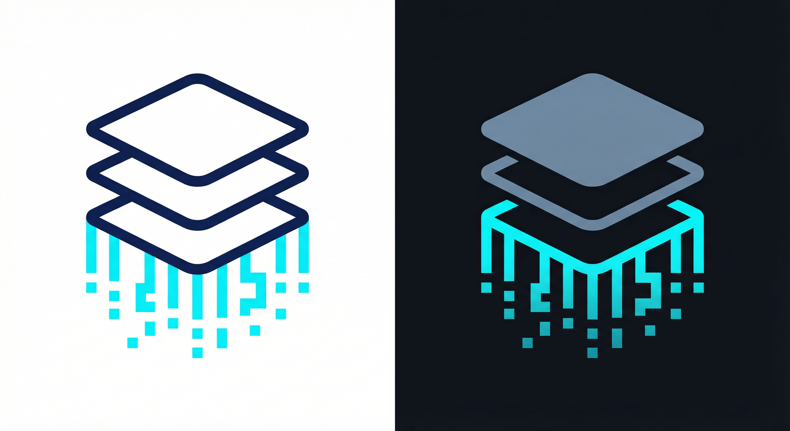

<p align="center">
  
</p>

<h3 align="center">ai-deepresearch-flow</h3>

<p align="center">
  <em>从文档到深度研究洞见，自动化完成。</em>
</p>

<p align="center">
  <a href="README.md">English</a> | <a href="README_ZH.md">中文</a>
</p>

<p align="center">
  <a href="https://github.com/nerdneilsfield/ai-deepresearch-flow/actions">
    
  </a>
  <a href="https://pypi.org/project/deepresearch-flow/">
    
  </a>
  <a href="https://pypi.org/project/deepresearch-flow/">
    
  </a>
  <a href="https://hub.docker.com/r/nerdneils/deepresearch-flow">
    
  </a>
  <a href="https://github.com/nerdneilsfield/ai-deepresearch-flow/pkgs/container/deepresearch-flow">
    
  </a>
  <a href="https://github.com/nerdneilsfield/ai-deepresearch-flow/blob/main/LICENSE">
    
  </a>
  <a href="https://github.com/nerdneilsfield/ai-deepresearch-flow/stargazers">
    
  </a>
  <a href="https://pypi.org/project/deepresearch-flow">
  
  </a>
  <a href="https://github.com/nerdneilsfield/ai-deepresearch-flow/issues">
    
  </a>
</p>

---

## 核心痛点

- **OCR 混乱**：OCR 产出的 Markdown 经常错乱，表格漂移、公式断裂、引用不可点击。
- **翻译灾难**：翻译技术论文时，代码块、LaTeX、表格结构很容易被破坏。
- **信息过载**：从海量 PDF 中提取作者、会议、摘要等结构化信息十分耗时。
- **频繁切换**：PDF、摘要、翻译分散在多个窗口，阅读体验割裂。

## 解决方案

DeepResearch Flow 提供一条完整流水线，覆盖 **修复**、**翻译**、**抽取** 与 **浏览服务**。

## 关键特性

- **智能抽取**：用 LLM 将非结构化 Markdown 转为结构化 JSON（摘要、元数据、问答）。
- **精准翻译**：翻译 OCR Markdown 到中文/日文（`.zh.md` / `.ja.md`），同时冻结公式、代码、表格与引用。
- **本地知识库**：高性能 Web UI，支持 Split View（原文/翻译/摘要）、全文搜索、多维过滤。
- **覆盖对比**：对比 JSON/PDF/Markdown/翻译产物，定位缺失并导出 CSV 报告。
- **匹配提取**：对比后导出已匹配的 JSON 或翻译 Markdown。
- **OCR 后处理**：自动修复引用（`[1]` -> `[^1]`）、合并断段并统一格式。

---

## 快速开始

### 1) 安装

```bash
# 推荐：使用 uv 加速
uv pip install deepresearch-flow

# 或标准 pip
pip install deepresearch-flow
```

### 2) 配置

配置 LLM 提供方（OpenAI、Claude、Gemini、Ollama 等）。

```bash
cp config.example.toml config.toml
# 编辑 config.toml 添加 API Key（例如 env:OPENAI_API_KEY）
```

### 3) 从零到一的流程

#### 步骤 1：抽取结构化信息

```bash
uv run deepresearch-flow paper extract \
  --input ./docs \
  --model openai/gpt-4o-mini \
  --prompt-template deep_read
```

#### 步骤 2：安全翻译

```bash
uv run deepresearch-flow translator translate \
  --input ./docs \
  --target-lang zh \
  --model openai/gpt-4o-mini \
  --fix-level moderate
```

#### 步骤 3：修复 OCR 产物（推荐）

推荐顺序：先修复 OCR，再修公式和流程图，最后再修一遍统一格式。

```bash
# 1) 修复 OCR Markdown（输入为 .json 时自动启用 JSON 模式）
uv run deepresearch-flow recognize fix \
  --input ./docs \
  --in-place

# 2) 修复 LaTeX 公式
uv run deepresearch-flow recognize fix-math \
  --input ./docs \
  --model openai/gpt-4o-mini \
  --in-place

# 3) 修复 Mermaid 图
uv run deepresearch-flow recognize fix-mermaid \
  --input ./paper_outputs \
  --json \
  --model openai/gpt-4o-mini \
  --in-place

# 4) 再修一遍统一格式
uv run deepresearch-flow recognize fix \
  --input ./docs \
  --in-place
```

#### 步骤 4：启动本地知识库

```bash
uv run deepresearch-flow paper db serve \
  --input paper_infos.json \
  --md-root ./docs \
  --md-translated-root ./docs \
  --host 127.0.0.1
```

---

## 增量构建 PDF 文献库流程

这个流程用于在 PDF 库持续增长时，只处理新增部分。

```bash
# 1) 对比已处理 JSON 和新 PDF 库，找到未处理的 PDF
uv run deepresearch-flow paper db compare \
  --input-a ./paper_infos.json \
  --pdf-root-b ./pdfs_new \
  --output-only-in-b ./pdfs_todo.txt

# 2) 把缺失 PDF 复制/移动到 OCR 目录
uv run deepresearch-flow paper db transfer-pdfs \
  --input-list ./pdfs_todo.txt \
  --output-dir ./pdfs_todo \
  --copy

# （可选）用 --move 替代 --copy
# uv run deepresearch-flow paper db transfer-pdfs --input-list ./pdfs_todo.txt --output-dir ./pdfs_todo --move

# 3) 对缺失的 PDF 做 OCR（外部工具，输出到 ./md_todo）

# 4) 从旧资产中提取与新 PDF 库匹配的部分
uv run deepresearch-flow paper db extract \
  --input-json ./paper_infos.json \
  --pdf-root ./pdfs_new \
  --output-json ./paper_infos_matched.json

uv run deepresearch-flow paper db extract \
  --md-source-root ./mds \
  --output-md-root ./mds_matched \
  --pdf-root ./pdfs_new

uv run deepresearch-flow paper db extract \
  --md-translated-root ./translated \
  --output-md-translated-root ./translated_matched \
  --pdf-root ./pdfs_new \
  --lang zh

# 5) 对 OCR 的新 Markdown 做翻译与摘要抽取
uv run deepresearch-flow translator translate \
  --input ./md_todo \
  --target-lang zh \
  --model openai/gpt-4o-mini

uv run deepresearch-flow paper extract \
  --input ./md_todo \
  --model openai/gpt-4o-mini

# 6) 合并并启动新的文献库（多输入）
uv run deepresearch-flow paper db serve \
  --input ./paper_infos_matched.json \
  --input ./paper_infos_new.json \
  --md-root ./mds_matched \
  --md-root ./md_todo \
  --md-translated-root ./translated_matched \
  --md-translated-root ./md_todo \
  --pdf-root ./pdfs_new
```

## 部署（静态 CDN）

推荐用两台服务器：一台跑 API/UI，另一台只提供静态资源（PDF/Markdown/图片）。

### 1) 导出静态资源

```bash
uv run deepresearch-flow paper db serve \
  --input paper_infos.json \
  --md-root ./docs \
  --md-translated-root ./docs \
  --pdf-root ./pdfs \
  --static-mode prod \
  --static-base-url https://static.example.com \
  --static-export-dir /data/paper-static
```

说明：
- API 服务器需要能读取原始 PDF/Markdown 根目录，用于建索引和计算哈希。
- CDN 服务器只需要导出的目录（例如 `/data/paper-static`）。

### 2) 静态服务器开启 CORS 和缓存（Caddy 示例）

```caddyfile
:8002 {
  root * /data/paper-static
  encode zstd gzip

  @static path /pdf/* /md/* /md_translate/* /images/*
  header @static {
    Access-Control-Allow-Origin *
    Access-Control-Allow-Methods GET,HEAD,OPTIONS
    Access-Control-Allow-Headers *
    Cache-Control "public, max-age=31536000, immutable"
  }

  @options method OPTIONS
  respond @options 204

  file_server
}
```

### 3) 启动 API/UI 并指向静态域名

```bash
export PAPER_DB_STATIC_BASE_URL="https://static.example.com"
export PAPER_DB_STATIC_MODE="prod"
export PAPER_DB_STATIC_EXPORT_DIR="/data/paper-static"
export PAPER_DB_PDFJS_CDN_BASE_URL="https://cdnjs.cloudflare.com/ajax/libs/pdf.js/4.0.379"

uv run deepresearch-flow paper db serve \
  --input paper_infos.json \
  --md-root ./docs \
  --md-translated-root ./docs \
  --pdf-root ./pdfs
```

---

## 详细说明

<details>
<summary><strong>1. Translator：OCR 安全翻译</strong></summary>

面向科研文档的翻译模块，使用 Node 级切分确保结构稳定。

- 结构保护：自动冻结代码块、LaTeX（`$$...$$`）、HTML 表格与图片。
- OCR 修复：`--fix-level` 支持断段合并与引用修复（`[1]` -> `[^1]`）。
- 失败恢复：支持失败重试与后备模型。
- 分组并发：使用 `--group-concurrency` 在单个文档内并行翻译多个分组。

```bash
uv run deepresearch-flow translator translate \
  --input ./paper.md \
  --target-lang ja \
  --fix-level aggressive \
  --group-concurrency 4 \
  --model claude/claude-3-5-sonnet-20240620
```

</details>

<details>
<summary><strong>2. Paper Extract：结构化知识</strong></summary>

将散乱 Markdown 变为可检索数据。

- 模板驱动：`simple` / `eight_questions` / `deep_read` 等模板控制抽取维度。
- 异步节流：通过 `--max-concurrency` 与 `--sleep-every` 控制请求节奏。
- 增量处理：跳过已处理文件，续跑不中断。

```bash
uv run deepresearch-flow paper extract \
  --input ./library \
  --output paper_data.json \
  --template-dir ./my-custom-prompts \
  --max-concurrency 10
```

</details>

<details>
<summary><strong>3. Database & UI：你的私人 ArXiv</strong></summary>

本地 Web UI 快速浏览研究库。

- Split View：左侧原文（PDF/Markdown），右侧摘要/翻译。
- 全文检索：按标题、作者、年份、标签检索（`tag:fpga year:2023..2024`）。
- 统计视图：可视化趋势与关键词。
- PDF Viewer：内置 PDF.js，避免本地文件跨域问题。

```bash
uv run deepresearch-flow paper db serve \
  --input paper_infos.json \
  --pdf-root ./pdfs \
  --cache-dir .cache/db
```

</details>

<details>
<summary><strong>4. Paper DB Compare：覆盖审计</strong></summary>

对比两个数据集（A/B），快速找出缺失的 PDF、Markdown、翻译或 JSON 条目，并输出匹配信息。

```bash
uv run deepresearch-flow paper db compare \
  --input-a ./a.json \
  --md-root-b ./md_root \
  --output-csv ./compare.csv

# 按语言对比翻译 Markdown
uv run deepresearch-flow paper db compare \
  --md-translated-root-a ./translated_a \
  --md-translated-root-b ./translated_b \
  --lang zh
```

</details>

<details>
<summary><strong>5. Paper DB Extract：匹配提取</strong></summary>

对比后导出已匹配的 JSON 条目或翻译 Markdown，并保持目录结构。

```bash
uv run deepresearch-flow paper db extract \
  --input-json ./processed.json \
  --pdf-root ./pdfs \
  --output-json ./matched.json \
  --output-csv ./extract.csv

# 按语言导出翻译 Markdown
uv run deepresearch-flow paper db extract \
  --md-root ./md_root \
  --md-translated-root ./translated \
  --lang zh \
  --output-md-translated-root ./translated_matched \
  --output-csv ./extract.csv
```

</details>

<details>
<summary><strong>6. Recognize：OCR 后处理</strong></summary>

面向 OCR 输出的清洗工具。

- Embed Images：将本地图片转为 Base64，生成单文件 Markdown。
- Unpack Images：将 Base64 图片拆回文件。
- Organize：整理 OCR 输出目录结构。
- Fix：对 Markdown 进行 OCR 修复与 rumdl 格式化。
- Fix JSON：对 JSON 中的 Markdown 字段进行同样修复。
- Fix Math：校验并修复 LaTeX 公式，可选 LLM 辅助修复。
- Fix Mermaid：校验并修复 Mermaid 图（需要 `mmdc` / mermaid-cli）。
- 推荐顺序：`fix` -> `fix-math` -> `fix-mermaid` -> `fix`。

```bash
uv run deepresearch-flow recognize md embed --input ./raw_ocr --output ./clean_md
```

```bash
# 组织 MinerU 输出并应用 OCR 修复
uv run deepresearch-flow recognize organize \
  --input ./mineru_outputs \
  --output-simple ./ocr_md \
  --fix

# 修复并输出到新目录
uv run deepresearch-flow recognize fix \
  --input ./ocr_md \
  --output ./ocr_md_fixed

# 就地修复
uv run deepresearch-flow recognize fix \
  --input ./ocr_md \
  --in-place

# 就地修复 JSON 输出
uv run deepresearch-flow recognize fix \
  --json \
  --input ./paper_outputs \
  --in-place

# 修复 Markdown 中的 LaTeX 公式
uv run deepresearch-flow recognize fix-math \
  --input ./docs \
  --model openai/gpt-4o-mini \
  --in-place

# 修复 JSON 中的 Mermaid 图
uv run deepresearch-flow recognize fix-mermaid \
  --json \
  --input ./paper_outputs \
  --model openai/gpt-4o-mini \
  --in-place
```

</details>

---

## Docker 支持

```bash
docker run --rm -v $(pwd):/app -it ghcr.io/nerdneilsfield/deepresearch-flow --help
```

## 配置说明

config.toml 支持：

- 多 Provider：OpenAI、DashScope、Gemini、Claude、Ollama 等。
- 模型路由：通过 `--model provider/model_name` 精确指定。
- 环境变量：使用 `env:VAR_NAME` 安全注入密钥。

详见 `config.example.toml`。

---

<p align="center">
  Built with love for the Open Science community.
</p>
