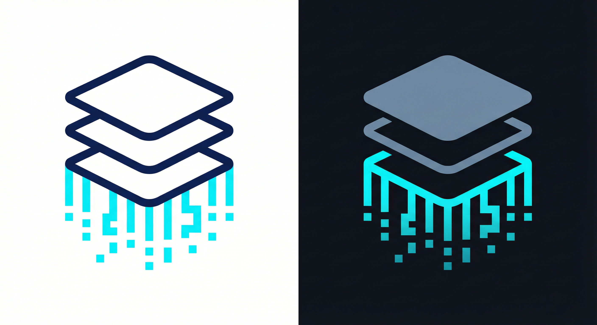
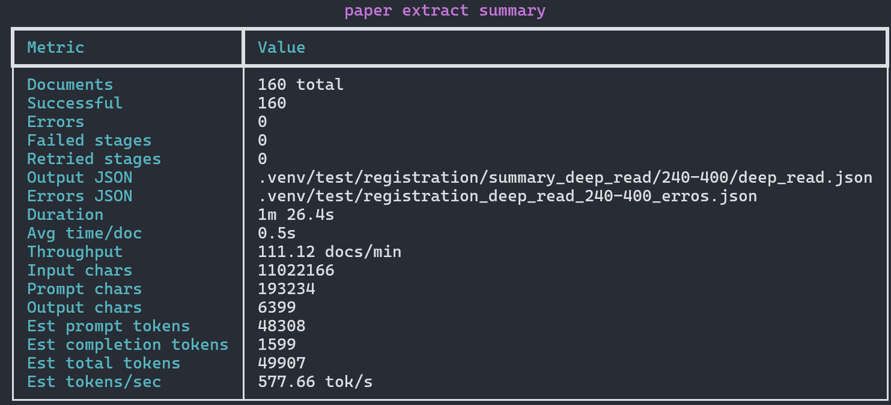
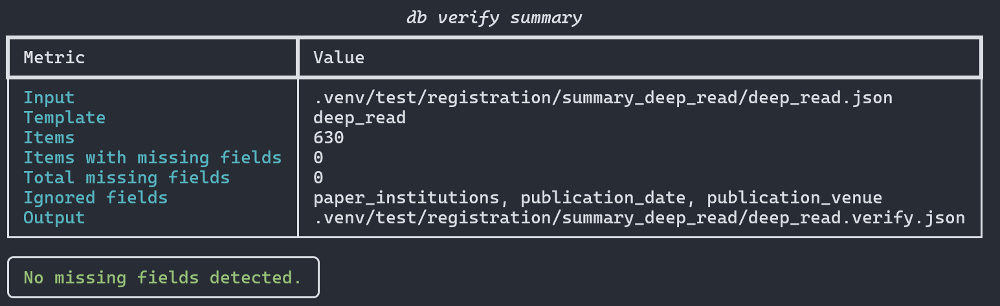
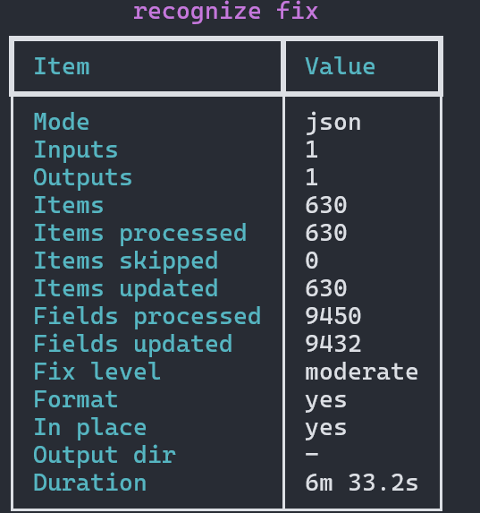
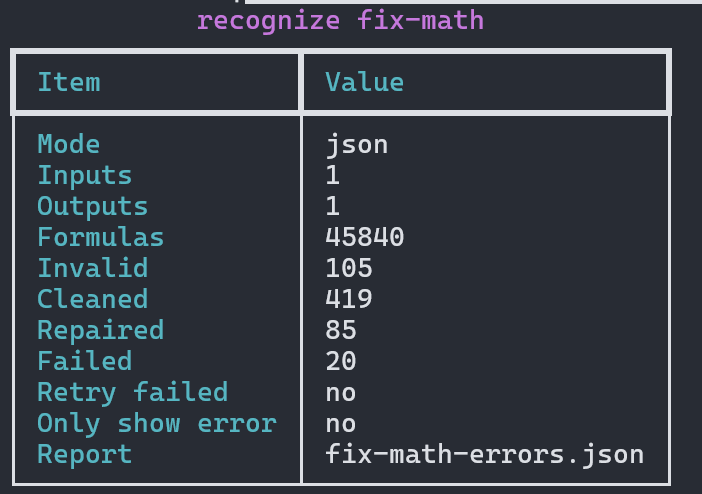
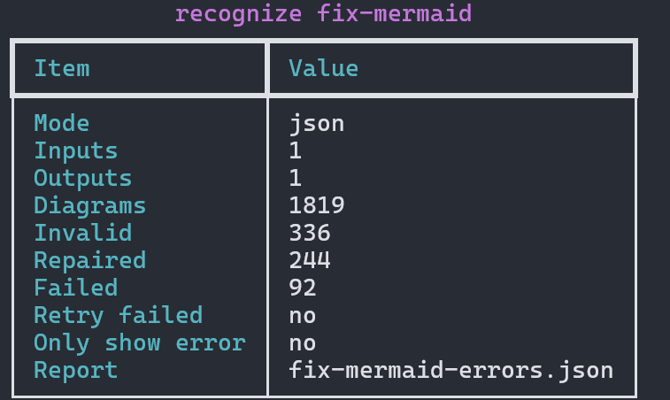
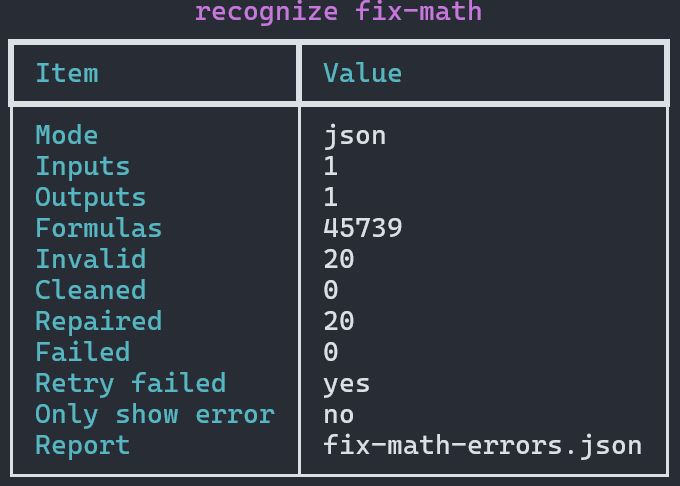
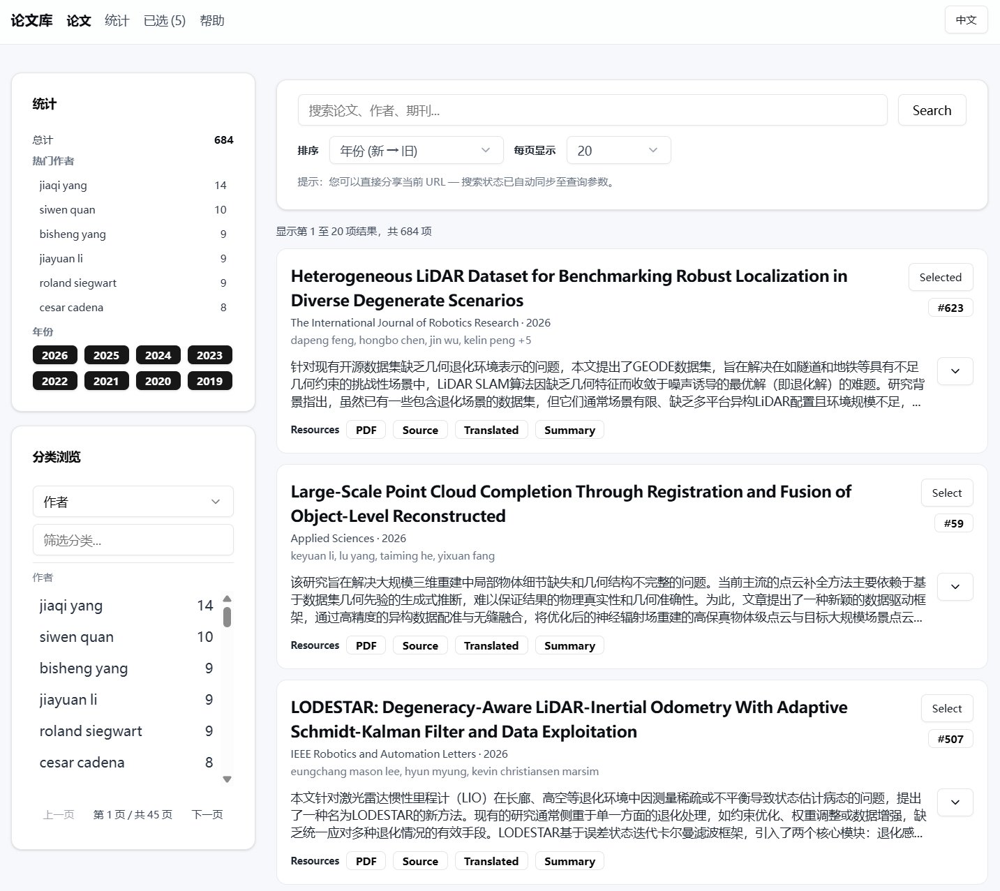

<p align="center">
  
</p>

<h3 align="center">ai-deepresearch-flow</h3>

<p align="center">
  <em>从文档到深度研究洞见，自动化完成。</em>
</p>

<p align="center">
  <a href="README.md">English</a> | <a href="README_ZH.md">中文</a>
</p>

<p align="center">
  <a href="https://github.com/nerdneilsfield/ai-deepresearch-flow/actions">
    
  </a>
  <a href="https://pypi.org/project/deepresearch-flow/">
    
  </a>
  <a href="https://pypi.org/project/deepresearch-flow/">
    
  </a>
  <a href="https://hub.docker.com/r/nerdneils/deepresearch-flow">
    
  </a>
  <a href="https://github.com/nerdneilsfield/ai-deepresearch-flow/pkgs/container/deepresearch-flow">
    
  </a>
  <a href="https://github.com/nerdneilsfield/ai-deepresearch-flow/blob/main/LICENSE">
    
  </a>
  <a href="https://github.com/nerdneilsfield/ai-deepresearch-flow/stargazers">
    
  </a>
  <a href="https://pypi.org/project/deepresearch-flow">
  
  </a>
  <a href="https://github.com/nerdneilsfield/ai-deepresearch-flow/issues">
    
  </a>
</p>

---

## 核心痛点

- **OCR 混乱**：OCR 产出的 Markdown 经常错乱，表格漂移、公式断裂、引用不可点击。
- **翻译灾难**：翻译技术论文时，代码块、LaTeX、表格结构很容易被破坏。
- **信息过载**：从海量 PDF 中提取作者、会议、摘要等结构化信息十分耗时。
- **频繁切换**：PDF、摘要、翻译分散在多个窗口，阅读体验割裂。

## 解决方案

DeepResearch Flow 提供一条完整流水线，覆盖 **修复**、**翻译**、**抽取** 与 **浏览服务**。

## 关键特性

- **智能抽取**：用 LLM 将非结构化 Markdown 转为结构化 JSON（摘要、元数据、问答）。
- **精准翻译**：翻译 OCR Markdown 到中文/日文（`.zh.md` / `.ja.md`），同时冻结公式、代码、表格与引用。
- **本地知识库**：高性能 Web UI，支持 Split View（原文/翻译/摘要）、全文搜索、多维过滤。
- **覆盖对比**：对比 JSON/PDF/Markdown/翻译产物，定位缺失并导出 CSV 报告。
- **匹配提取**：对比后导出已匹配的 JSON 或翻译 Markdown。
- **OCR 后处理**：自动修复引用（`[1]` -> `[^1]`）、合并断段并统一格式。

---

## 快速开始

### 1) 安装

```bash
# 推荐：使用 uv 加速
uv pip install deepresearch-flow

# 或标准 pip
pip install deepresearch-flow
```

### 2) 配置

配置 LLM 提供方（OpenAI、Claude、Gemini、Ollama 等）。

```bash
cp config.example.toml config.toml
# 编辑 config.toml，配置加权 provider、key 和 model
```

Breaking change：旧的 `api_keys`、`model_list`、`structured_mode` 字段已经不再支持。
新配置结构改为：

- 顶层 `main_model`：模型层加权路由
- `providers[].base[]`：URL 层加权路由
- `providers[].base[].key[]`：Key 层加权路由
- `providers[].models[]`：模型能力声明

缺失的 `env:VAR_NAME` 现在会在加载配置时直接报错。

翻译器的模型默认值和调度默认值也可以放在 `[translator_config]`：

```toml
[translator_config]
model = "openai/gpt-4o-mini"
fallback_model = "claude/claude-sonnet-4-5-20250929"
# fallback_model_2 = "ollama/llama3.1"
document_window = 8
initial_workers = 4
retry_workers = 2
fallback_workers = 2
fallback_2_workers = 2
main_concurrency = 4
fallback_concurrency = 2
fallback_2_concurrency = 2
```

单个 key 的配额信息仍然挂在 key 对象上：

```toml
main_model = [
  { model = "openai/gpt-4o-mini", weight = 4 },
  { model = "claude/claude-sonnet-4-5-20250929", weight = 1 }
]

[[providers]]
name = "openai"
type = "openai_compatible"
base = [
  { url = "https://api.openai.com/v1", weight = 1, key = [
    { value = "env:OPENAI_API_KEY", weight = 4 },
    { value = "env:OPENAI_API_KEY_2", weight = 1, quota_duration = 18000, reset_time = "2026-01-23 18:04:25 +0800 CST", quota_error_tokens = ["exceed", "quota"] }
  ] }
]
models = [
  { model_name = "gpt-4o-mini", is_stream = true, is_support_json_schema = true, is_support_json_object = true }
]
```

```toml
[embedding]
default_model = "Qwen3-Embedding-4B"
default_provider = "ollama"
dimensions = 1024
normalized = true
batch_size = 32
chunk_max_tokens = 512
chunk_overlap_tokens = 64

[[embedding.providers]]
name = "ollama"
type = "openai_compatible"
base = [
  { url = "http://localhost:11434/v1", weight = 1, key = [{ value = "ollama", weight = 1 }] }
]
models = [
  { model_name = "Qwen3-Embedding-4B", dimensions = 1024, max_context = 32768 },
  { model_name = "bge-m3", dimensions = 1024, max_context = 8192 }
]

[[embedding.providers]]
name = "siliconflow"
type = "openai_compatible"
base = [
  { url = "https://api.siliconflow.cn/v1", weight = 1, key = [{ value = "env:SF_KEY", weight = 1 }] }
]
models = [
  { model_name = "Qwen/Qwen3-Embedding-4B", dimensions = 2560, max_context = 32768 }
]

[rerank]
enabled = true
default_model = "BAAI/bge-reranker-v2-m3"
default_provider = "siliconflow"
top_n = 10

[[rerank.providers]]
name = "siliconflow"
type = "openai_compatible"
base = [
  { url = "https://api.siliconflow.cn/v1", weight = 1, key = [{ value = "env:SF_KEY", weight = 1 }] }
]
models = [
  { model_name = "BAAI/bge-reranker-v2-m3", max_context = 8192, max_chunks_per_doc = 1024 },
  { model_name = "Qwen/Qwen3-Reranker-8B", max_context = 32768, instruction = "Rerank by relevance" }
]
```

### 3) 从零到一的流程

#### 步骤 1：抽取结构化信息

```bash
uv run deepresearch-flow paper extract \
  --input ./docs \
  --model openai/gpt-4o-mini \
  --prompt-template deep_read
```

<p align="center">
  
</p>

#### 步骤 1.1：校验与重试缺失字段

按模板 schema 校验抽取结果，并仅重跑缺失项。

```bash
uv run deepresearch-flow paper db verify \
  --input-json ./paper_infos.json \
  --prompt-template deep_read \
  --output-json ./paper_verify.json

uv run deepresearch-flow paper extract \
  --input ./docs \
  --model openai/gpt-4o-mini \
  --prompt-template deep_read \
  --retry-list-json ./paper_verify.json
```

<p align="center">
  
</p>

#### 步骤 2：安全翻译

```bash
uv run deepresearch-flow translator translate \
  --input ./docs \
  --target-lang zh \
  --model openai/gpt-4o-mini \
  --fix-level moderate
```

#### 步骤 2.5：对 PDF/图片执行 OCR（可选）

如果源文档是 PDF 或扫描图片，先跑 OCR 生成 markdown：

```bash
# 1) 复制并编辑 OCR 配置
cp ocr.example.toml ocr.toml
# 设置 PaddleOCR token: export PADDLE_OCR_TOKEN=xxx

# 2) 对目录下的 PDF 执行 OCR
uv run deepresearch-flow recognize ocr ./pdfs --config ocr.toml --output-dir ./ocr_output
```

输出兼容 mineru 布局（每个文档一个 `full.md` + `images/` 目录），可直接进入下面的修复流程。

配置详见 [`ocr.example.toml`](ocr.example.toml)。目前支持 PaddleOCR 后端，更多后端待扩展。

#### 步骤 3：修复 OCR 产物（推荐）

推荐顺序：先修复 OCR，再修公式和流程图，最后再修一遍统一格式。

```bash
# 1) 修复 OCR Markdown（输入为 .json 时自动启用 JSON 模式）
uv run deepresearch-flow recognize fix \
  --input ./docs \
  --in-place
```

<p align="center">
  
</p>

```bash
# 2) 修复 LaTeX 公式
uv run deepresearch-flow recognize fix-math \
  --input ./docs \
  --model openai/gpt-4o-mini \
  --in-place
```

<p align="center">
  
</p>

```bash
# 3) 修复 Mermaid 图
uv run deepresearch-flow recognize fix-mermaid \
  --input ./paper_outputs \
  --json \
  --model openai/gpt-4o-mini \
  --in-place
```

<p align="center">
  
</p>

```bash
# （可选）仅重试失败的公式/图
uv run deepresearch-flow recognize fix-math \
  --input ./docs \
  --model openai/gpt-4o-mini \
  --retry-failed

uv run deepresearch-flow recognize fix-mermaid \
  --input ./paper_outputs \
  --json \
  --model openai/gpt-4o-mini \
  --retry-failed
```

<p align="center">
  
</p>

```bash
# 4) 再修一遍统一格式
uv run deepresearch-flow recognize fix \
  --input ./docs \
  --in-place
```

#### 步骤 4：启动本地知识库

```bash
uv run deepresearch-flow paper db serve \
  --input paper_infos.json \
  --md-root ./docs \
  --md-translated-root ./docs \
  --host 127.0.0.1
```

#### 步骤 4.1：启用语义搜索（可选）

先从抽取结果或 snapshot 构建 LanceDB 向量索引：

```bash
# 从一个或多个抽取 JSON 构建向量库
uv run deepresearch-flow paper embed \
  --config ./config.toml \
  --input ./paper_infos.json \
  --output-embed-db ./paper_vectors

# 或对已经构建好的 snapshot + static export 补建/重建向量库
uv run deepresearch-flow paper embed \
  --config ./config.toml \
  --snapshot-db ./dist/paper_snapshot.db \
  --static-export-dir ./dist/paper_static \
  --output-embed-db ./paper_vectors

# 或在构建 snapshot 时顺手生成向量库
uv run deepresearch-flow paper db snapshot build \
  --input ./paper_infos.json \
  --output-embed-db ./paper_vectors
```

在 CLI 里执行语义搜索：

```bash
uv run deepresearch-flow paper search \
  --config ./config.toml \
  --embed-db ./paper_vectors \
  --query "attention mechanism in transformer" \
  --top-n 10
```

在本地 Web UI 中开启语义搜索：

```bash
uv run deepresearch-flow paper db serve \
  --input ./paper_infos.json \
  --md-root ./docs \
  --md-translated-root ./docs \
  --embed-db ./paper_vectors \
  --search-access-token "your-token"
```

说明：

- `paper embed` 支持重复传入 `-i/--input`，会把同一篇论文的多个模板一起合并入索引。
- `paper embed --snapshot-db --static-export-dir` 支持对已经构建好的 snapshot 在后续单独补建或重建向量库。
- `paper search` 会使用 `[[embedding.providers]]` 里的 embedding provider/model，并可选启用 hybrid recall 和 `[[rerank.providers]]` 里的云端 rerank。
- Web UI 搜索框右侧会出现锁按钮。输入一次 token 后会保存在浏览器中，后续访问 `/api/papers/semantic` 会自动复用。
- `paper db snapshot build --output-embed-db` 可以一次生成 snapshot 和 LanceDB 向量索引。

#### 步骤 5：启用 MCP（FastMCP Streamable HTTP + SSE）

本项目使用 [FastMCP](https://gofastmcp.com) 提供 MCP 服务，挂载在 snapshot API 的 `/mcp` 与 `/mcp-sse` 路径下。

```bash
# 启动 snapshot API（包含 MCP）
export PAPER_DB_STATIC_BASE_URL="https://static.example.com"
export PAPER_DB_STATIC_EXPORT_DIR="/data/paper-static"  # 本地静态目录可选

# 基础模式：只开启关键词 / facet / 论文详情等只读接口
uv run deepresearch-flow paper db api serve \
  --snapshot-db /data/paper_snapshot.db \
  --cors-origin https://frontend.example.com \
  --host 0.0.0.0 --port 8001

# 高级搜索模式：额外提供 LanceDB 和访问 token
SEARCH_ACCESS_TOKEN=your-token \
uv run deepresearch-flow paper db api serve \
  --snapshot-db /data/paper_snapshot.db \
  --embed-db /data/paper_vectors \
  --config ./config.toml \
  --cors-origin https://frontend.example.com \
  --host 0.0.0.0 --port 8001
```

BibTeX 元数据接口：

- `GET /api/v1/papers/{paper_id}/bibtex`
- 成功返回：`{ paper_id, doi, bibtex_raw, bibtex_key, entry_type }`
- 错误码：
  - `paper_not_found`
  - `bibtex_not_found`

MCP 客户端配置：
- Streamable HTTP 端点：`http://<host>:8001/mcp`
- SSE 端点：`http://<host>:8001/mcp-sse`
- 传输行为：
  - `/mcp`：仅支持 HTTP POST（GET 返回 405）
  - `/mcp-sse`：支持 SSE（允许 GET 握手）
- Summary/Source/Translation 由 MCP 服务器代理读取静态资源并返回文本内容（不返回 URL）

**FastMCP 特性**：
- 使用 `fastmcp>=3.0.0b1`，支持 stateless HTTP 模式
- 所有 Tools 和 Resources 同时支持 `/mcp` 与 `/mcp-sse`
- 支持 CORS 配置，可限制 Origin 访问

**补充说明**：
- 可选请求头：`mcp-protocol-version`（支持 `2025-03-26` / `2025-06-18`）
- 静态资源读取优先级：`PAPER_DB_STATIC_EXPORT_DIR`（本地目录优先）→ `PAPER_DB_STATIC_BASE` / `PAPER_DB_STATIC_BASE_URL`（HTTP 拉取兜底）

##### MCP Tools（函数）

<details>
<summary><strong>search_papers(query, limit=10)</strong> — 全文检索（相关性排序）</summary>

- 参数：
  - `query`（str）：主题关键词
  - `limit`（int）：返回数量（会被限制到 API 的最大 page size）
- 返回：`[{ paper_id, title, year, venue, snippet_markdown }, ...]`

</details>

<details>
<summary><strong>search_papers_by_keyword(keyword, limit=10)</strong> — 按关键词 facet 检索</summary>

- 参数：
  - `keyword`（str）：关键词子串
  - `limit`（int）：返回数量（会被限制）
- 返回：`[{ paper_id, title, year, venue, snippet_markdown }, ...]`

</details>

<details>
<summary><strong>get_paper_metadata(paper_id)</strong> — 元信息 + 可用 summary 模板</summary>

- 参数：
  - `paper_id`（str）
- 返回（dict）包含：
  - `paper_id`, `title`, `year`, `venue`
  - `doi`, `arxiv_id`, `openreview_id`, `paper_pw_url`
  - `has_bibtex`
  - `preferred_summary_template`, `available_summary_templates`

</details>

<details>
<summary><strong>get_paper_bibtex(paper_id)</strong> — 持久化 BibTeX 数据</summary>

- 参数：
  - `paper_id`（str）
- 返回（dict）包含：
  - `paper_id`, `doi`, `bibtex_raw`, `bibtex_key`, `entry_type`
- 错误：
  - `paper_not_found`
  - `bibtex_not_found`

</details>

<details>
<summary><strong>get_paper_summary(paper_id, template=None, max_chars=None)</strong> — summary JSON 原文</summary>

- 说明：
  - `template` 为空时使用 `preferred_summary_template`
  - 返回 **JSON 内容本身**（不是 URL）
- 参数：
  - `paper_id`（str）
  - `template`（str | null）
  - `max_chars`（int | null）：截断上限
- 返回：JSON 字符串（可能包含 `[truncated: ...]` 标记）

</details>

<details>
<summary><strong>get_paper_source(paper_id, max_chars=None)</strong> — source Markdown 原文</summary>

- 参数：
  - `paper_id`（str）
  - `max_chars`（int | null）：截断上限
- 返回：Markdown 字符串（可能包含 `[truncated: ...]` 标记）

</details>

<details>
<summary><strong>get_database_stats()</strong> — 数据库统计</summary>

- 返回：
  - `total`
  - `years`, `months`：`[{ value, paper_count }, ...]`
  - `authors`, `venues`, `institutions`, `keywords`, `tags`：top 列表 `[{ value, paper_count }, ...]`

</details>

<details>
<summary><strong>list_top_facets(category, limit=20)</strong> — 列出某类 facet Top 值</summary>

- 参数：
  - `category`：`author | venue | keyword | institution | tag`
  - `limit`（int）
- 返回：`[{ value, paper_count }, ...]`

</details>

<details>
<summary><strong>filter_papers(author=None, venue=None, year=None, keyword=None, tag=None, limit=10)</strong> — 结构化过滤</summary>

- 参数（除 `limit` 外均可选）：
  - `author`, `venue`, `keyword`, `tag`：子串匹配
  - `year`：精确匹配
  - `limit`（int）：返回数量（会被限制）
- 返回：`[{ paper_id, title, year, venue }, ...]`

</details>

##### MCP Resources（URI）

<details>
<summary><strong>paper://{paper_id}/metadata</strong> — 元信息 JSON</summary>

返回与 `get_paper_metadata(paper_id)` 等价的内容（JSON 字符串）。

</details>

<details>
<summary><strong>paper://{paper_id}/summary</strong> — 默认 summary JSON</summary>

返回与 `get_paper_summary(paper_id)` 等价的内容（preferred template；JSON 字符串）。

</details>

<details>
<summary><strong>paper://{paper_id}/summary/{template}</strong> — 指定模板 summary JSON</summary>

返回与 `get_paper_summary(paper_id, template=template)` 等价的内容（JSON 字符串）。

</details>

<details>
<summary><strong>paper://{paper_id}/source</strong> — source Markdown</summary>

返回与 `get_paper_source(paper_id)` 等价的内容（Markdown 字符串）。

</details>

<details>
<summary><strong>paper://{paper_id}/translation/{lang}</strong> — 翻译 Markdown</summary>

返回指定 `lang`（例如 `zh` / `ja`）的翻译 Markdown（若存在）。

</details>

---

## 增量构建 PDF 文献库流程

这个流程用于在 PDF 库持续增长时，只处理新增部分。

```bash
# 1) 对比已处理 JSON 和新 PDF 库，找到未处理的 PDF
uv run deepresearch-flow paper db compare \
  --input-a ./paper_infos.json \
  --pdf-root-b ./pdfs_new \
  --output-only-in-b ./pdfs_todo.txt

# 2) 把缺失 PDF 复制/移动到 OCR 目录
uv run deepresearch-flow paper db transfer-pdfs \
  --input-list ./pdfs_todo.txt \
  --output-dir ./pdfs_todo \
  --copy

# （可选）用 --move 替代 --copy
# uv run deepresearch-flow paper db transfer-pdfs --input-list ./pdfs_todo.txt --output-dir ./pdfs_todo --move

# 3) 对缺失的 PDF 做 OCR（外部工具，输出到 ./md_todo）

# 4) 从旧资产中提取与新 PDF 库匹配的部分
uv run deepresearch-flow paper db extract \
  --input-json ./paper_infos.json \
  --pdf-root ./pdfs_new \
  --output-json ./paper_infos_matched.json

uv run deepresearch-flow paper db extract \
  --md-source-root ./mds \
  --output-md-root ./mds_matched \
  --pdf-root ./pdfs_new

uv run deepresearch-flow paper db extract \
  --md-translated-root ./translated \
  --output-md-translated-root ./translated_matched \
  --pdf-root ./pdfs_new \
  --lang zh

# 5) 对 OCR 的新 Markdown 做翻译与摘要抽取
uv run deepresearch-flow translator translate \
  --input ./md_todo \
  --target-lang zh \
  --model openai/gpt-4o-mini

uv run deepresearch-flow paper extract \
  --input ./md_todo \
  --model openai/gpt-4o-mini

# 6) 合并并启动新的文献库（多输入）
uv run deepresearch-flow paper db serve \
  --input ./paper_infos_matched.json \
  --input ./paper_infos_new.json \
  --md-root ./mds_matched \
  --md-root ./md_todo \
  --md-translated-root ./translated_matched \
  --md-translated-root ./md_todo \
  --pdf-root ./pdfs_new
```

## 合并论文 JSON

```bash
# 合并同模板的多文献库
uv run deepresearch-flow paper db merge library \
  --inputs ./paper_infos_a.json \
  --inputs ./paper_infos_b.json \
  --output ./paper_infos_merged.json

# 合并同文献库的多模板结果（共享字段以第一个输入为准）
uv run deepresearch-flow paper db merge templates \
  --inputs ./simple.json \
  --inputs ./deep_read.json \
  --output ./paper_infos_templates.json
```

说明：`paper db merge` 已拆分为 `merge library` 与 `merge templates`。

### 合并多个数据库（PDF + Markdown + BibTeX）

```bash
# 1) 把 PDF 拷到同一个目录
rsync -av ./pdfs_a/ ./pdfs_merged/
rsync -av ./pdfs_b/ ./pdfs_merged/

# 2) 把 Markdown 拷到同一个目录
rsync -av ./md_a/ ./md_merged/
rsync -av ./md_b/ ./md_merged/

# 3) 合并 JSON 文献库
uv run deepresearch-flow paper db merge library \
  --inputs ./paper_infos_a.json \
  --inputs ./paper_infos_b.json \
  --output ./paper_infos_merged.json

# 4) 合并 BibTeX
uv run deepresearch-flow paper db merge bibtex \
  -i ./library_a.bib \
  -i ./library_b.bib \
  -o ./library_merged.bib
```

### 合并 BibTeX 文件

```bash
uv run deepresearch-flow paper db merge bibtex \
  -i ./library_a.bib \
  -i ./library_b.bib \
  -o ./library_merged.bib
```

重复 key 会保留字段数最多的条目；字段数相同则按输入顺序保留第一个。

### 推荐流程：先合并模板再用 BibTeX 过滤

```bash
# 1) 合并同文献库的多模板结果
uv run deepresearch-flow paper db merge templates \
  --inputs ./deep_read.json \
  --inputs ./simple.json \
  --output ./all.json

# 2) 用 BibTeX 过滤合并结果
uv run deepresearch-flow paper db extract \
  --input-bibtex ./library.bib \
  --json ./all.json \
  --output-json ./library_filtered.json \
  --output-csv ./library_filtered.csv
```

## 部署（静态 CDN）

推荐的生产方案是 **前后端分离**：

- **静态 CDN**：PDF/Markdown/图片/summary 静态资源
- **API 服务**：只读 Snapshot DB
- **前端**：独立静态站点（Vite build 或任意静态托管）

<p align="center">
  
</p>

### 1) 构建 snapshot + 导出静态资源

```bash
uv run deepresearch-flow paper db snapshot build \
  --input ./paper_infos.json \
  --bibtex ./papers.bib \
  --md-root ./docs \
  --md-translated-root ./docs \
  --pdf-root ./pdfs \
  --output-db ./dist/paper_snapshot.db \
  --static-export-dir /data/paper-static
```

说明：
- 构建机器需要能读取原始 PDF/Markdown 根目录。
- CDN 服务器只需要导出的目录（例如 `/data/paper-static`）。

### 2) 静态服务器开启 CORS 和缓存（Caddy 示例）

```caddyfile
:8002 {
  root * /data/paper-static
  encode zstd gzip

  @static path /pdf/* /md/* /md_translate/* /images/*
  header @static {
    Access-Control-Allow-Origin *
    Access-Control-Allow-Methods GET,HEAD,OPTIONS
    Access-Control-Allow-Headers *
    Cache-Control "public, max-age=31536000, immutable"
  }

  @options method OPTIONS
  respond @options 204

  file_server
}
```

### 2.1) Nginx 示例（API + 前端同域名，静态资源独立域名）

```nginx
# 前端 + API（同域名）
server {
  listen 80;
  server_name frontend.example.com;

  root /var/www/paper-frontend;
  index index.html;

  location / {
    try_files $uri /index.html;
  }

  location /api/ {
    proxy_pass http://127.0.0.1:8001;
    proxy_set_header Host $host;
    proxy_set_header X-Real-IP $remote_addr;
    proxy_set_header X-Forwarded-For $proxy_add_x_forwarded_for;
  }

  location ^~ /mcp {
    proxy_pass http://127.0.0.1:8001;
    proxy_set_header Host $host;
    proxy_set_header X-Real-IP $remote_addr;
    proxy_set_header X-Forwarded-For $proxy_add_x_forwarded_for;
  }

  # 给需要 SSE 的 MCP 客户端使用
  location ^~ /mcp-sse {
    proxy_pass http://127.0.0.1:8001;
    proxy_http_version 1.1;
    proxy_set_header Connection "";
    proxy_set_header Host $host;
    proxy_set_header X-Real-IP $remote_addr;
    proxy_set_header X-Forwarded-For $proxy_add_x_forwarded_for;
    proxy_buffering off;
    proxy_cache off;
    proxy_read_timeout 3600s;
    proxy_send_timeout 3600s;
    chunked_transfer_encoding off;
    add_header X-Accel-Buffering no;
  }
}

# 静态资源（独立域名）
server {
  listen 80;
  server_name static.example.com;

  root /data/paper-static;

  location / {
    add_header Access-Control-Allow-Origin *;
    add_header Access-Control-Allow-Methods "GET,HEAD,OPTIONS";
    add_header Access-Control-Allow-Headers "*";
    add_header Cache-Control "public, max-age=31536000, immutable";
    try_files $uri =404;
  }
}
```

### 3) 启动 API 服务（只读）

```bash
export PAPER_DB_STATIC_BASE_URL="https://static.example.com"

# 方式 A：基础模式（不挂载高级搜索路由）
uv run deepresearch-flow paper db api serve \
  --snapshot-db /data/paper_snapshot.db \
  --cors-origin https://frontend.example.com \
  --host 0.0.0.0 --port 8001

# 方式 B：完全通过 CLI 打开高级搜索
SEARCH_ACCESS_TOKEN=your-token \
uv run deepresearch-flow paper db api serve \
  --snapshot-db /data/paper_snapshot.db \
  --embed-db /data/paper_vectors \
  --config ./config.toml \
  --cors-origin https://frontend.example.com \
  --host 0.0.0.0 --port 8001
```

也可以通过 `config.toml` 打开高级搜索：

```toml
[search]
advanced_enabled = true
vector_dir = "/data/paper_vectors"
access_token = "env:SEARCH_ACCESS_TOKEN"
```

```bash
export PAPER_DB_STATIC_BASE_URL="https://static.example.com"
export SEARCH_ACCESS_TOKEN="your-token"

# 方式 C：使用 config.search.vector_dir + config.search.access_token
uv run deepresearch-flow paper db api serve \
  --snapshot-db /data/paper_snapshot.db \
  --config ./config.toml \
  --cors-origin https://frontend.example.com \
  --host 0.0.0.0 --port 8001
```

高级搜索启动规则：

- `--embed-db` 优先级最高，会覆盖 `config.search.vector_dir`。
- token 优先级是 `--search-access-token` > `SEARCH_ACCESS_TOKEN` > `config.search.access_token`。
- 如果 `config.search.advanced_enabled = true`，但既没有 `--embed-db` 也没有 `config.search.vector_dir`，服务会在启动时直接失败。
- 如果 `config.search.advanced_enabled = false`，服务会正常启动，但不会挂载高级搜索路由。

### 3.1) Admin API（可选）

启用 Admin API 可通过 Bearer Token 认证远程添加或删除论文。

```bash
# 通过环境变量启用
PAPER_DB_ADMIN_TOKEN=your-secret-token \
uv run deepresearch-flow paper db api serve \
  --snapshot-db /data/paper_snapshot.db \
  --cors-origin https://frontend.example.com \
  --host 0.0.0.0 --port 8001
```

也可通过命令行参数传入：`--admin-token your-secret-token`

端点（均需 `Authorization: Bearer <token>` 请求头）：

- `POST /api/v1/admin/papers` — 批量添加论文（每次最多 200 篇）
  ```bash
  curl -X POST https://api.example.com/api/v1/admin/papers \
    -H "Authorization: Bearer your-secret-token" \
    -H "Content-Type: application/json" \
    -d '{"papers": [{"paper_title": "...", "paper_authors": [...], ...}]}'
  ```
  响应：`{ added, skipped, errors, paper_ids }`

- `DELETE /api/v1/admin/papers/{paper_id}` — 删除论文及所有关联数据
  ```bash
  curl -X DELETE https://api.example.com/api/v1/admin/papers/{paper_id} \
    -H "Authorization: Bearer your-secret-token"
  ```
  响应：`{ deleted: true, paper_id }`

论文 JSON 格式与 `snapshot update` 的输入格式一致。元数据通过 admin API 写入；如果配置了 `remote.storage`，静态文件（PDF、Markdown、图片）会在 `api push` 后续阶段单独推送。

#### 从本地 DB 推送到远程

使用 `api push` 将本地构建的 snapshot DB 合并到远程部署：

```toml
# remote.toml
[remote]
api_base_url = "https://api.example.com"
admin_token = "env:PAPER_DB_ADMIN_TOKEN"
batch_size = 10

[remote.storage]
type = "webdav"
url = "https://cdn.example.com/paper-static"
username = "deploy"
password = "env:PAPER_DB_WEBDAV_PASSWORD"
```

```bash
# 预览待推送内容
uv run deepresearch-flow paper db api push \
  --snapshot-db ./dist/paper_snapshot.db \
  --static-export-dir ./dist/paper-static \
  --config remote.toml \
  --dry-run

# 正式推送
uv run deepresearch-flow paper db api push \
  --snapshot-db ./dist/paper_snapshot.db \
  --static-export-dir ./dist/paper-static \
  --config remote.toml

# 只推送 admin API 元数据
uv run deepresearch-flow paper db api push \
  --snapshot-db ./dist/paper_snapshot.db \
  --static-export-dir ./dist/paper-static \
  --config remote.toml \
  --only-api

# 只推送静态存储文件
uv run deepresearch-flow paper db api push \
  --snapshot-db ./dist/paper_snapshot.db \
  --static-export-dir ./dist/paper-static \
  --config remote.toml \
  --only-storage \
  --storage-concurrency 8

# 仅重试上次静态文件推送失败的条目
uv run deepresearch-flow paper db api push \
  --snapshot-db ./dist/paper_snapshot.db \
  --static-export-dir ./dist/paper-static \
  --config remote.toml \
  --retry-failed push-static-errors.json
```

- `--static-export-dir` 可选 — 提供后会将 summary JSON 内容一并推送，使远端可构建 FTS 索引和预览文本。
- 重复论文（相同 `paper_id`）会自动跳过。
- 配置 `[remote.storage]` 后，元数据 API 推送完成后会继续推送静态文件。
- 当前支持的静态存储后端是 `webdav`。
- 静态文件推送时会逐文件打印状态日志：`uploaded`、`skipped`、`failed`。
- 如果部分静态文件推送失败，会生成 `push-static-errors.json`，可用 `--retry-failed` 只重试失败项。
- `--only-api` 只推送 admin API 元数据，跳过静态存储推送。
- `--only-storage` 只推送静态存储文件，跳过 admin API 元数据步骤。
- `--storage-concurrency` 用于控制静态存储推送时的并发 worker 数。
- `--only-api` 与 `--only-storage` 互斥，不能同时使用。
- `--dry-run` 不能与 `--only-storage` 一起使用。
- `--retry-failed` 只作用于静态存储，不能与 `--only-api` 一起使用。
- 如果更新后的 `summary` / `manifest` JSON 只在某一个浏览器里表现异常，先尝试强制刷新或清理该浏览器的站点缓存；静态 JSON 在 push 之后可能会被陈旧浏览器缓存影响。

### 4) 前端（开发 / 构建）

```bash
cd frontend
npm install

# 开发
VITE_PAPER_DB_API_BASE=https://api.example.com/api/v1 \
VITE_PAPER_DB_STATIC_BASE=https://static.example.com \
npm run dev

# 构建后部署静态站点
VITE_PAPER_DB_API_BASE=https://api.example.com/api/v1 \
VITE_PAPER_DB_STATIC_BASE=https://static.example.com \
npm run build
```

### 5) 补充缺失的模板（可选）

如果某些论文缺少特定模板（如 `deep_read`），可以识别缺口并补充提取：

```bash
# 1) 检查 snapshot 中缺失的模板
uv run deepresearch-flow paper db snapshot show-missing \
  --snapshot-db ./dist/paper_snapshot.db

# 2) 导出缺少特定模板的论文（包含文件路径用于提取）
uv run deepresearch-flow paper db snapshot export-missing \
  --snapshot-db ./dist/paper_snapshot.db \
  --type template \
  --template deep_read \
  --static-export-dir ./dist/paper-static \
  --output ./missing_deep_read.json \
  --txt-output ./missing_ids.txt \
  --output-paths ./extractable_paths.txt

# 3) 补充提取缺失的模板（仅针对有 source markdown 的论文）
uv run deepresearch-flow paper extract \
  --model openai/gpt-4o-mini \
  --prompt-template deep_read \
  --input-list ./extractable_paths.txt \
  --output ./deep_read_supplement.json

# 4) 与现有的 paper_infos.json 合并
uv run deepresearch-flow paper db merge library \
  --inputs ./paper_infos.json \
  --inputs ./deep_read_supplement.json \
  --output ./paper_infos_complete.json

# 5) 用完整数据重建 snapshot
uv run deepresearch-flow paper db snapshot build \
  --input ./paper_infos_complete.json \
  --bibtex ./papers.bib \
  --md-root ./docs \
  --md-translated-root ./docs \
  --pdf-root ./pdfs \
  --output-db ./dist/paper_snapshot_complete.db \
  --static-export-dir ./dist/paper-static-complete
```

**替代方案 1：补充缺失内容（模板/翻译）**

如果现有论文缺少模板或翻译，无需重建即可补充：

```bash
# 为现有论文补充缺失的模板（原地修改）
uv run deepresearch-flow paper db snapshot supplement \
  --snapshot-db ./dist/paper_snapshot.db \
  --static-export-dir ./dist/paper-static \
  -i ./deep_read_supplement.json \
  --in-place

# 或输出到新位置
uv run deepresearch-flow paper db snapshot supplement \
  --snapshot-db ./dist/paper_snapshot.db \
  --static-export-dir ./dist/paper-static \
  -i ./deep_read_supplement.json \
  --output-db ./dist/paper_snapshot_supplemented.db \
  --output-static-dir ./dist/paper-static-supplemented
```

说明：
- `snapshot supplement` 的 `--md-root` 与 `--md-translated-root` 都是可选参数。
- 仅当你需要从本地目录解析/复制 markdown 文件时才需要传入。

**替代方案 2：添加新论文**

如果有全新的论文要添加到 snapshot：

```bash
# 添加新论文到现有 snapshot（原地修改）
uv run deepresearch-flow paper db snapshot update \
  --snapshot-db ./dist/paper_snapshot.db \
  --static-export-dir ./dist/paper-static \
  -i ./new_papers.json \
  -b ./new_papers.bib \
  --md-root ./docs \
  --md-translated-root ./docs_translated \
  --pdf-root ./pdfs \
  --in-place

# 或输出到新位置
uv run deepresearch-flow paper db snapshot update \
  --snapshot-db ./dist/paper_snapshot.db \
  --static-export-dir ./dist/paper-static \
  -i ./new_papers.json \
  -b ./new_papers.bib \
  --md-root ./docs \
  --output-db ./dist/paper_snapshot_updated.db \
  --output-static-dir ./dist/paper-static-updated
```

**区别：**
- `supplement`：只为**已有**论文补充缺失的模板/翻译（跳过新论文）
- `update`：只添加**全新**论文（跳过已有论文）

#### 将旧版 Snapshot 升级到 DOI/BibTeX 新格式

**推荐：就地迁移升级（零数据丢失）**

如果现有 snapshot 是 DOI/BibTeX 支持上线前构建的，建议使用 `migrate` 命令升级数据库 schema，不会丢失任何论文：

```bash
# 就地迁移（自动创建带时间戳的备份）
uv run deepresearch-flow paper db snapshot migrate \
  --snapshot-db ./dist/paper_snapshot.db \
  --bibtex ./papers.bib \
  --static-export-dir ./dist/paper-static \
  --in-place

# 或者复制到新位置
uv run deepresearch-flow paper db snapshot migrate \
  --snapshot-db ./dist/paper_snapshot.db \
  --bibtex ./papers.bib \
  --static-export-dir ./dist/paper-static \
  --output-db ./dist/paper_snapshot_v2.db

# 仅升级 schema（不进行 BibTeX 匹配）
uv run deepresearch-flow paper db snapshot migrate \
  --snapshot-db ./dist/paper_snapshot.db \
  --in-place
```

功能特性：
- **零数据丢失**：使用 `ALTER TABLE` 升级 schema，保留所有论文
- **带时间戳的备份**：自动创建 `.bak_YYYYMMDD_HHMMSS` 格式的备份文件
- **BibTeX 匹配**：自动匹配论文与 BibTeX 条目并提取 DOI 元数据
- **静态导出更新**：同步更新 `paper_index.json` 的 DOI/BibTeX 引用
- **美观输出**：使用 Rich 表格展示 schema 变更和匹配统计信息

迁移过程包括：
1. 创建带时间戳的备份（除非使用 `--no-backup`）
2. 在 `paper` 表中添加 `doi` 列（如果缺失）
3. 创建 `paper_bibtex` 表（如果缺失）
4. 匹配论文与 BibTeX 条目，填充 DOI/BibTeX 数据
5. 更新静态导出索引的元数据

**备选方案：使用旧快照重建**

如果需要从零重建，同时保持 paper identity 连续性：

```bash
uv run deepresearch-flow paper db snapshot build \
  --input ./paper_infos_complete.json \
  --bibtex ./papers.bib \
  --output-db ./dist/paper_snapshot_v2.db \
  --static-export-dir ./dist/paper-static-v2 \
  --previous-snapshot-db ./dist/paper_snapshot.db
```

说明：
- 这次重建中的 `--md-root`、`--md-translated-root`、`--pdf-root` 均为可选。
- 对同一篇论文，当前输入里有 DOI/BibTeX 时优先使用当前输入；否则可从 `--previous-snapshot-db` 继承。
- **警告**：此方法仅包含输入 JSON 文件中的论文，请确保包含所有论文以避免数据丢失。

#### 补充缺失的翻译

如果某些论文缺少翻译（如 `zh`），可以导出并翻译它们：

```bash
# 1) 导出缺少中文翻译的论文（包含文件路径）
uv run deepresearch-flow paper db snapshot export-missing \
  --snapshot-db ./dist/paper_snapshot.db \
  --type translation \
  --lang zh \
  --static-export-dir ./dist/paper-static \
  --output-paths ./to_translate_paths.txt

# 2) 翻译缺失的论文
uv run deepresearch-flow translator translate \
  --input ./docs \
  --target-lang zh \
  --model openai/gpt-4o-mini \
  --input-list ./to_translate_paths.txt \
  --output-dir ./docs_translated

# 3) 用新的翻译重建或补充 snapshot
uv run deepresearch-flow paper db snapshot build ...
# 或者使用 snapshot supplement 仅添加翻译
```

其他有用的导出类型：
- `--type source_md` - 没有源 Markdown 的论文
- `--type pdf` - 没有 PDF 的论文
- `--type translation --lang zh` - 没有中文翻译的论文

---

## 详细说明

<details>
<summary><strong>1. Translator：OCR 安全翻译</strong></summary>

面向科研文档的翻译模块，使用 Node 级切分确保结构稳定。

- 结构保护：自动冻结代码块、LaTeX（`$$...$$`）、HTML 表格与图片。
- OCR 修复：`--fix-level` 支持断段合并与引用修复（`[1]` -> `[^1]`）。
- 失败恢复：支持失败重试与后备模型。
- 多文档调度：文档首轮、重试、fallback 现在分开走独立队列。
- 并发控制：使用 `--document-window`、`--initial-workers`、`--retry-workers`，以及 `--main-concurrency` / fallback 并发参数。
- 配置默认值：可以把 `model` / `fallback_model` / `fallback_model_2` 以及同一套并发默认值写到 `config.toml` 的 `[translator_config]` 里。
- 兼容提示：`--group-concurrency` 已废弃，会映射到 `--initial-workers`。

```bash
uv run deepresearch-flow translator translate \
  --input ./papers \
  --target-lang ja \
  --fix-level aggressive \
  --document-window 8 \
  --initial-workers 4 \
  --retry-workers 2 \
  --main-concurrency 4 \
  --model claude/claude-3-5-sonnet-20240620
```

</details>

<details>
<summary><strong>2. Paper Extract：结构化知识</strong></summary>

将散乱 Markdown 变为可检索数据。

- 模板驱动：`simple` / `eight_questions` / `deep_read` 等模板控制抽取维度。
- 异步节流：通过 `--max-concurrency`、`--sleep-every` 控制请求节奏，并可用 `--timeout` 调整请求超时。
- 增量处理：跳过已处理文件，续跑不中断。
- 分模块恢复：多阶段模板会持久化每个模块输出，可用 `--force-stage <name>` 重跑某模块。
- DAG 调度：启用 `--stage-dag`（或 `extract.stage_dag = true`）进行依赖就绪并行；DAG 模式只向阶段注入依赖输出，`--dry-run` 会打印每个阶段的执行计划。
- 图示提示：`deep_read` 允许输出带 `[Inferred]` 标注的推断图示；如需修复 Mermaid，可对渲染后的 Markdown 使用 `recognize fix-mermaid`。
- 阶段聚焦：多阶段运行时强调当前模块，其他模块只给摘要，降低上下文干扰。
- 范围过滤：使用 `--start-idx/--end-idx` 切片输入；范围先于 `--retry-failed`/`--retry-failed-stages` 生效（`--end-idx -1` 表示最后一项）。
- 失败阶段重试：使用 `--retry-failed-stages` 仅重跑失败 stage（多阶段模板）；缺失 stage 会被强制补跑。串行重试只会把仍需执行的 stage 放入计划，且最终 `paper_infos.json` 会与最终 `errors.json` 保持一致（仍有未解决错误的文档不会继续保留在输出中）。

```bash
uv run deepresearch-flow paper extract \
  --input ./library \
  --output paper_data.json \
  --template-dir ./my-custom-prompts \
  --max-concurrency 10 \
  --timeout 180

# 先取 0..99，再仅重跑该范围内失败的文件
uv run deepresearch-flow paper extract \
  --input ./library \
  --start-idx 0 \
  --end-idx 100 \
  --retry-failed \
  --model claude/claude-3-5-sonnet-20240620

# 仅重试失败 stage（多阶段模板）
uv run deepresearch-flow paper extract \
  --input ./library \
  --retry-failed-stages \
  --model claude/claude-3-5-sonnet-20240620
```

</details>

<details>
<summary><strong>4. Recognize Fix：修复公式与 Mermaid</strong></summary>

修复 Markdown/JSON 中损坏的 LaTeX 公式和 Mermaid 图。

- 重试失败：使用 `--retry-failed` 搭配之前的 `--report` 输出，仅重试失败项。

```bash
uv run deepresearch-flow recognize fix-math \
  --input ./docs \
  --in-place \
  --model claude/claude-3-5-sonnet-20240620 \
  --report ./fix-math-errors.json \
  --retry-failed

uv run deepresearch-flow recognize fix-mermaid \
  --input ./docs \
  --in-place \
  --model claude/claude-3-5-sonnet-20240620 \
  --report ./fix-mermaid-errors.json \
  --retry-failed
```

</details>

<details>
<summary><strong>3. Database & UI：你的私人 ArXiv</strong></summary>

本地 Web UI 快速浏览研究库。

- Split View：左侧原文（PDF/Markdown），右侧摘要/翻译。
- 全文检索：按标题、作者、年份、标签检索（`tag:fpga year:2023..2024`）。
- 统计视图：可视化趋势与关键词。
- PDF Viewer：内置 PDF.js，避免本地文件跨域问题。

```bash
uv run deepresearch-flow paper db serve \
  --input paper_infos.json \
  --pdf-root ./pdfs \
  --cache-dir .cache/db
```

</details>

<details>
<summary><strong>4. Paper DB Compare：覆盖审计</strong></summary>

对比两个数据集（A/B），快速找出缺失的 PDF、Markdown、翻译或 JSON 条目，并输出匹配信息。

```bash
uv run deepresearch-flow paper db compare \
  --input-a ./a.json \
  --md-root-b ./md_root \
  --output-csv ./compare.csv

# 按语言对比翻译 Markdown
uv run deepresearch-flow paper db compare \
  --md-translated-root-a ./translated_a \
  --md-translated-root-b ./translated_b \
  --lang zh
```

</details>

<details>
<summary><strong>5. Paper DB Extract：匹配提取</strong></summary>

对比后导出已匹配的 JSON 条目或翻译 Markdown，并保持目录结构。

```bash
uv run deepresearch-flow paper db extract \
  --json ./processed.json \
  --input-bibtex ./refs.bib \
  --pdf-root ./pdfs \
  --output-json ./matched.json \
  --output-csv ./extract.csv

# 使用 JSON 参考清单筛选目标 JSON
uv run deepresearch-flow paper db extract \
  --json ./processed.json \
  --input-json ./reference.json \
  --pdf-root ./pdfs \
  --output-json ./matched.json \
  --output-csv ./extract.csv

# 按语言导出翻译 Markdown
uv run deepresearch-flow paper db extract \
  --md-root ./md_root \
  --md-translated-root ./translated \
  --lang zh \
  --output-md-translated-root ./translated_matched \
  --output-csv ./extract.csv
```

</details>

<details>
<summary><strong>6. Recognize：OCR 后处理</strong></summary>

面向 OCR 输出的清洗工具。

- Embed Images：将本地图片转为 Base64，生成单文件 Markdown。
- Unpack Images：将 Base64 图片拆回文件。
- Organize：整理 OCR 输出目录结构。
- Fix：对 Markdown 进行 OCR 修复与 rumdl 格式化。
- Fix JSON：对 JSON 中的 Markdown 字段进行同样修复。
- Fix Math：校验并修复 LaTeX 公式，可选 LLM 辅助修复。
- Fix Mermaid：校验并修复 Mermaid 图（需要 `mmdc` / mermaid-cli）。
- 推荐顺序：`fix` -> `fix-math` -> `fix-mermaid` -> `fix`。

```bash
uv run deepresearch-flow recognize md embed --input ./raw_ocr --output ./clean_md
```

```bash
# 组织 MinerU 输出并应用 OCR 修复
uv run deepresearch-flow recognize organize \
  --input ./mineru_outputs \
  --output-simple ./ocr_md \
  --fix

# 修复并输出到新目录
uv run deepresearch-flow recognize fix \
  --input ./ocr_md \
  --output ./ocr_md_fixed

# 就地修复
uv run deepresearch-flow recognize fix \
  --input ./ocr_md \
  --in-place

# 就地修复 JSON 输出
uv run deepresearch-flow recognize fix \
  --json \
  --input ./paper_outputs \
  --in-place

# 修复 Markdown 中的 LaTeX 公式
uv run deepresearch-flow recognize fix-math \
  --input ./docs \
  --model openai/gpt-4o-mini \
  --in-place

# 修复 JSON 中的 Mermaid 图
uv run deepresearch-flow recognize fix-mermaid \
  --json \
  --input ./paper_outputs \
  --model openai/gpt-4o-mini \
  --in-place
```

</details>

---

## Docker 支持

```bash
docker run --rm -v $(pwd):/app -it ghcr.io/nerdneilsfield/deepresearch-flow:latest --help
```

Deploy 镜像（nginx + API + 前端）：

```bash
docker run --rm -p 8899:8899 \
  -v $(pwd)/paper_snapshot.db:/db/papers.db \
  -v $(pwd)/paper-static:/static \
  ghcr.io/nerdneilsfield/deepresearch-flow:deploy-latest
```

说明：
- nginx 对外监听 8899，并将 `/api`、`/mcp`、`/mcp-sse` 代理到内部 API `127.0.0.1:8000`。
- 将 snapshot 数据库挂载到容器内 `/db/papers.db`。
- 如果静态资源由此容器提供，请将 snapshot 静态目录挂载到 `/static`（默认 `PAPER_DB_STATIC_BASE` 为 `/static`）。
- 如果 `PAPER_DB_STATIC_BASE` 是完整 URL（例如 `https://static.example.com`），nginx 仍仅提供本地前端，API 响应中的静态资源链接会使用该外部域名。

Docker Compose 示例（两种模式）：

```bash
docker compose -f scripts/docker/docker-compose.example.yml --profile local-static up
# 或者
docker compose -f scripts/docker/docker-compose.example.yml --profile external-static up
```

外部静态资源示例：

```bash
docker run --rm -p 8899:8899 \
  -v $(pwd)/paper_snapshot.db:/db/papers.db \
  -e PAPER_DB_STATIC_BASE=https://static.example.com \
  ghcr.io/nerdneilsfield/deepresearch-flow:deploy-latest
```

## 配置说明

config.toml 支持：

- 多 Provider：OpenAI、DashScope、Gemini、Claude、Ollama 等。
- 通过 `main_model`、`providers[].base[]`、`providers[].base[].key[]` 实现三级加权负载均衡。
- 真实 LLM 请求会从共享的 runtime pool 中取 route，因此 `model -> base -> key` 的加权选择是按请求执行，而不是只在进程启动时选一次。
- `--model` 同时支持单个 `provider/model`、内联 JSON 模型池、以及 `@file` JSON 模型池。`paper extract` 省略 `--model` 时会回退到 `config.toml` 的 `main_model`。
- 环境变量：使用 `env:VAR_NAME` 安全注入密钥。

示例：

```bash
# 使用 config.toml 的 main_model
uv run deepresearch-flow paper extract --input ./docs

# 固定单模型
uv run deepresearch-flow paper extract --input ./docs --model openai/gpt-4o-mini

# 内联 JSON 覆盖 main_model
uv run deepresearch-flow paper extract \
  --input ./docs \
  --model '[{"model":"openai/gpt-4o-mini","weight":4},{"model":"claude/claude-sonnet-4-5-20250929","weight":1}]'

# 从文件加载 main_model
uv run deepresearch-flow paper extract \
  --input ./docs \
  --model @main_model.json
```

mode 探测：

```bash
# 只探测，不回写
uv run deepresearch-flow utils test-mode \
  --config ./config.toml \
  --model openai/gpt-4o-mini

# 探测并写回配置
uv run deepresearch-flow utils test-mode \
  --config ./config.toml \
  --model openai/gpt-4o-mini \
  --write-back
```

`utils test-mode` 目前只会按权重选中一条 `base + key` 路径进行探测；而正常的提取、翻译、识别修复、标签生成流程，都会在每次请求前从 runtime pool 中重新选路。

详见 `config.example.toml`。

---

<p align="center">
  Built with love for the Open Science community.
</p>
